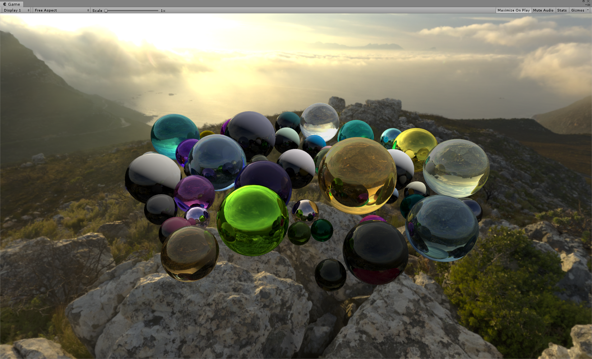
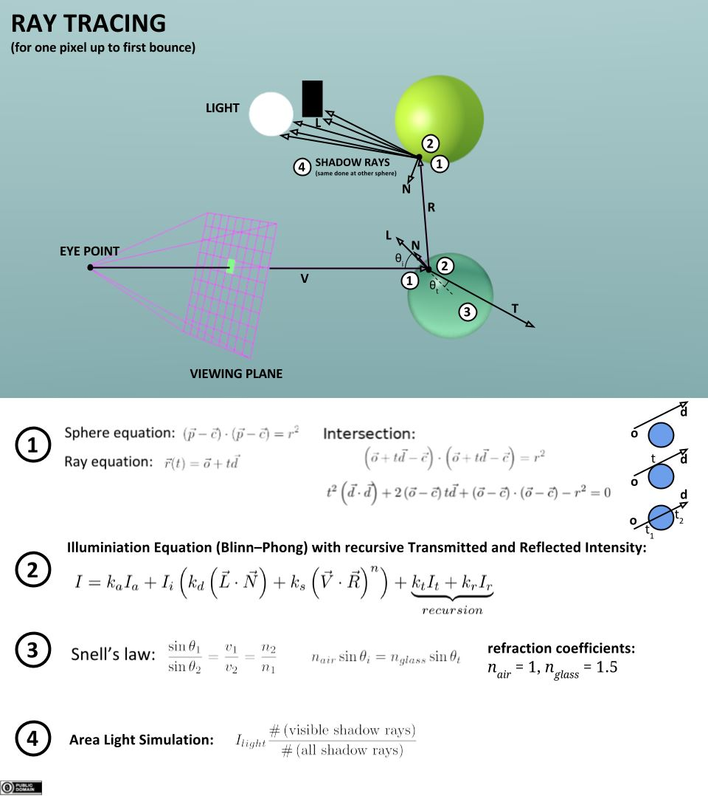

# Whitted Ray Tracer in Unity3D using compute shader

Unity 2018.3.7f1 (win10 64-bit)

## Features:
1. Whitted Ray Tracing
2. Diffuse, specular, refraction, Fresnel

## Principle:

## Reference:
[GPU Ray Tracing in Unity – Part 1](http://blog.three-eyed-games.com/2018/05/03/gpu-ray-tracing-in-unity-part-1/)   
[An Improved Illumination Model for Shaded Display](https://dl.acm.org/doi/pdf/10.1145/358876.358882)   
[Reflection, Refraction (Transmission) and Fresnel](https://www.scratchapixel.com/lessons/3d-basic-rendering/introduction-to-shading/reflection-refraction-fresnel)   
[Webgl中采用PBR的实时光线追踪](https://zhuanlan.zhihu.com/p/58692781)
